<p align="center">
  
</p>

# 💰 Riyal  ريال

> **Know where your money goes.**

Riyal (ريال) is a bilingual Arabic/English Flutter mobile application designed to help users track recurring spending, manage personal budgets, and better understand where their money goes.

The app brings subscriptions, utility bills, and payments to people into one organized experience, while providing spending analytics, reminders, recurring-payment detection, and AI-powered financial guidance.

---

## 💡 Why Riyal?

Today, almost everything has become a subscription, from streaming and entertainment to software, apps, cloud storage, and everyday services. With so many recurring payments, it can be easy to lose track of what you're paying for, when it renews, or how much you're spending each month.

Riyal was created to make managing payments simpler. It automatically detects recurring payments and categorizes them, while providing smart insights into where your money is going. It also helps users track free trials, upcoming renewals, and price changes.

But Riyal isn't limited to subscriptions. It also helps users organize and manage other recurring expenses, such as **utility bills, allowances, and payments to people**, giving them one place to keep track of the payments that matter in their everyday lives.

**Because when everything is a payment, keeping track shouldn't be. 💚**

---

## ✨ Features

### 💳 Unified Recurring Payments

Track recurring expenses across three main categories:

- Subscriptions
- Utility Bills
- People & Allowances

Each category has its own organization, tracking, and budget monitoring.

### 📊 Budget Management

Set a separate monthly budget for:

- Subscriptions
- Utilities
- People payments

Riyal continuously monitors spending and visually indicates when spending approaches or exceeds a budget limit.

### 📈 Spending Analytics

Understand spending through:

- Total monthly spending
- Category-based spending
- Spending trends
- Budget progress
- Monthly financial reviews

### 🔄 Recurring Payment Detection

Riyal analyzes simulated transaction data to identify recurring payments automatically.

When a merchant appears repeatedly, the system recognizes the pattern and automatically classifies the payment into the appropriate category.

A merchant appearing four or more times can be automatically recognized as a recurring payment without requiring manual confirmation.

### 🔔 Smart Notifications

Riyal provides reminders and alerts for:

- Upcoming recurring payments
- Budget limits
- Subscription price increases
- Free-trial endings
- Monthly spending reviews

### 🎁 Free-Trial Tracking

Users can add weekly or monthly free trials and receive an in-app reminder five days before the trial ends.

### 🤖 Riyal Bot

Riyal includes an AI-powered assistant built with the Gemini API.

Riyal Bot is specifically scoped to questions related to:

- Budgeting
- Spending
- Saving
- Subscriptions
- Bills

It supports both Arabic and English.

The assistant does not have live access to real bank accounts and does not claim to perform real financial actions.

### 🏦 Simulated Bank Connections

Users can connect to a simulated bank account or skip the connection and add payments manually.

The project includes mock representations of several Saudi banks, including:

- Al Rajhi
- STC Bank
- BSF
- Bank AlJazira
- Saudi Investment Bank
- Alinma
- GIB
- SAB
- Bank Albilad
- And others

### 🌐 Arabic & English

The application is fully localized in Arabic and English, including RTL support for Arabic.

### 📱 Responsive Design

The interface is designed to adapt across different mobile screen sizes while maintaining consistent spacing, typography, and layouts.

---

## 📱 App Screens

### Authentication

| Splash | Login | Sign Up |
|:---:|:---:|:---:|
| 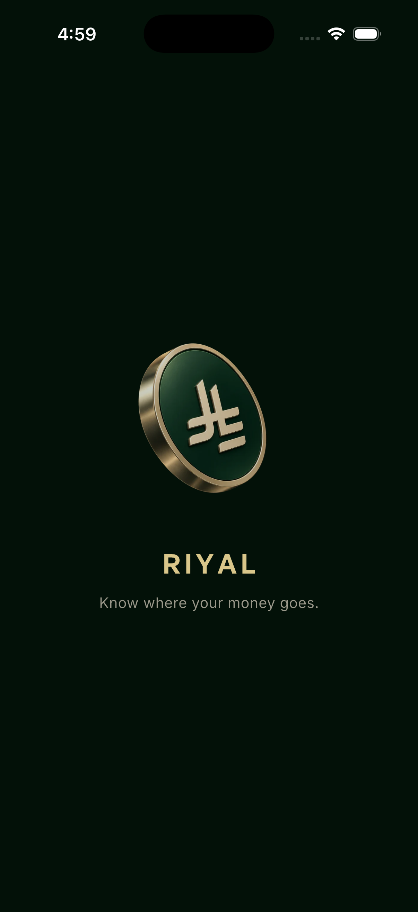 | 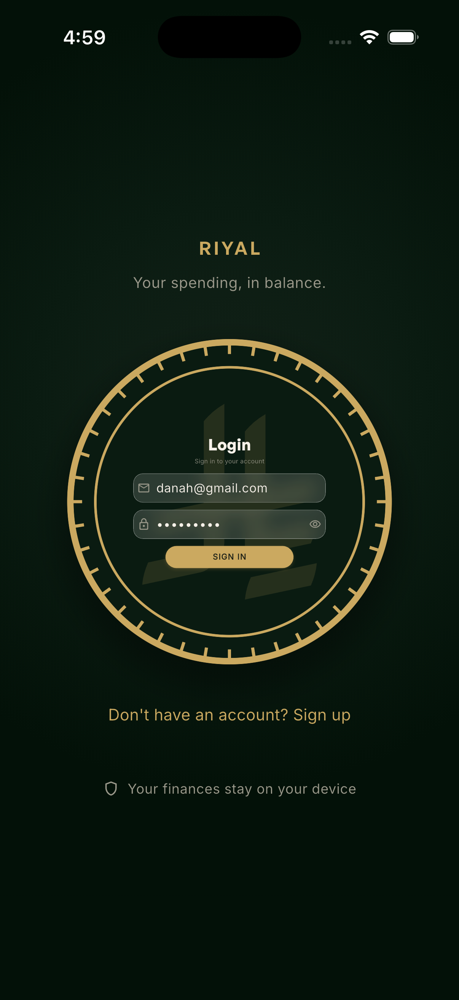 | 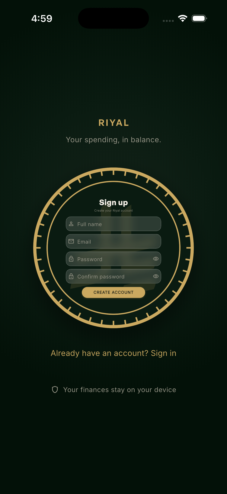 |

### Main Experience

| Home | Home — Renewals | Subscriptions | Subscriptions — Add | Filtration | Utilities | People |
|:---:|:---:|:---:|:---:|:---:|:---:|:---:|
| 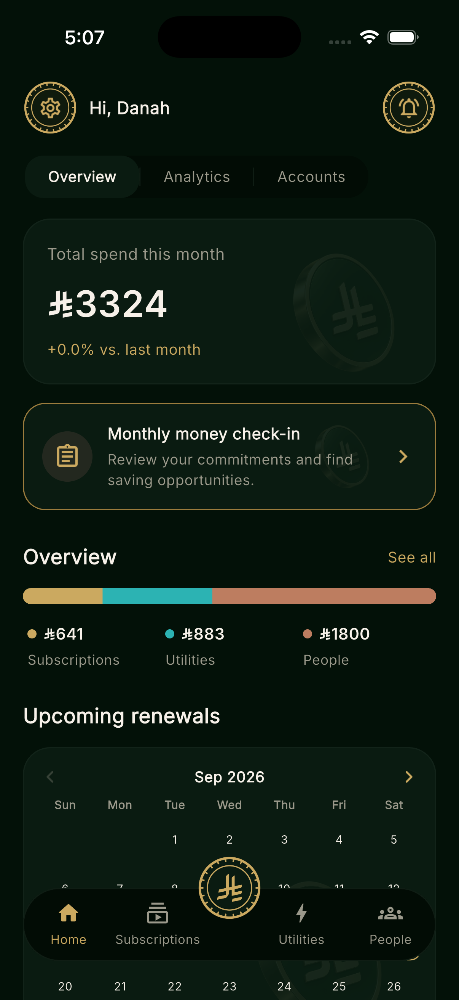 | 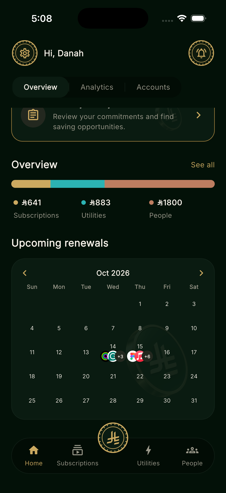 | 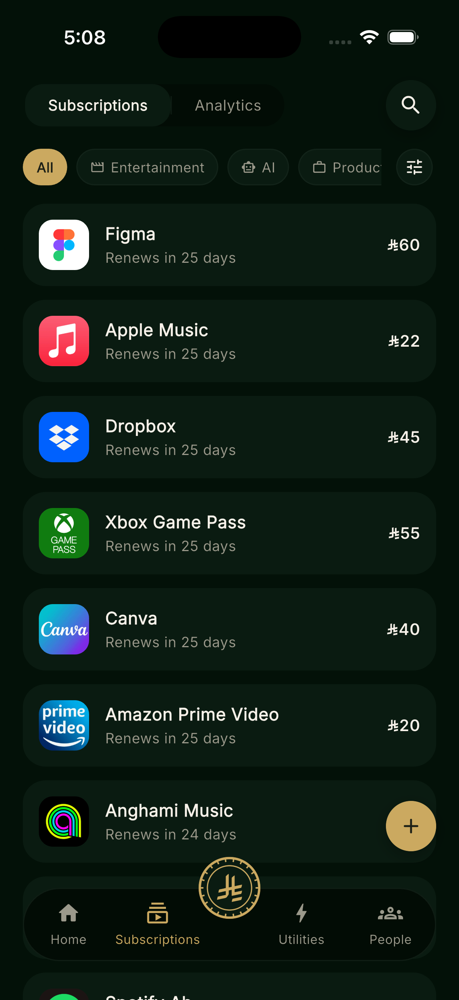 | 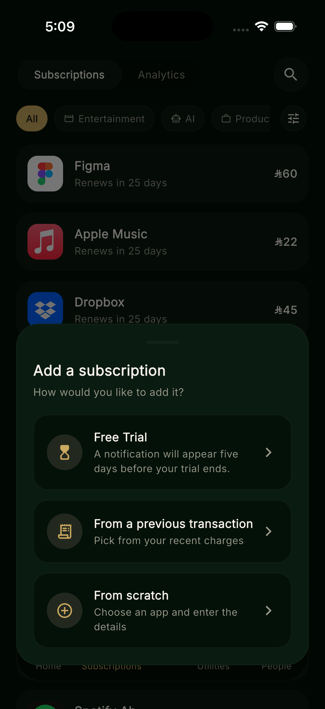 | 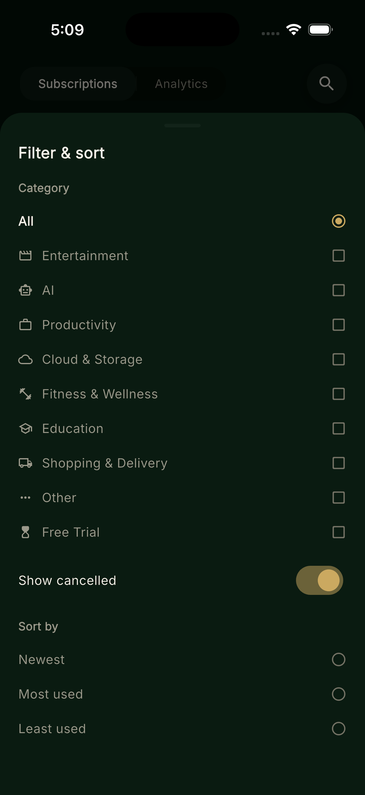 | 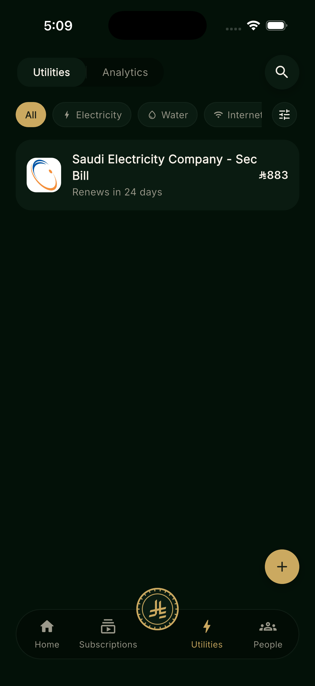 | 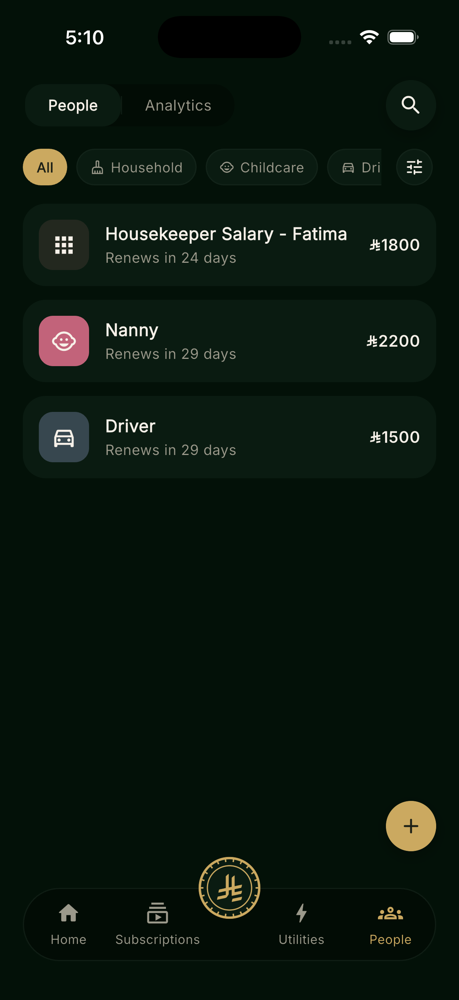 |

### Insights & Management

| Analytics | Analytics — Breakdown | Monthly Review | Accounts | Connect a Bank | Riyal Assistant |
|:---:|:---:|:---:|:---:|:---:|:---:|
| 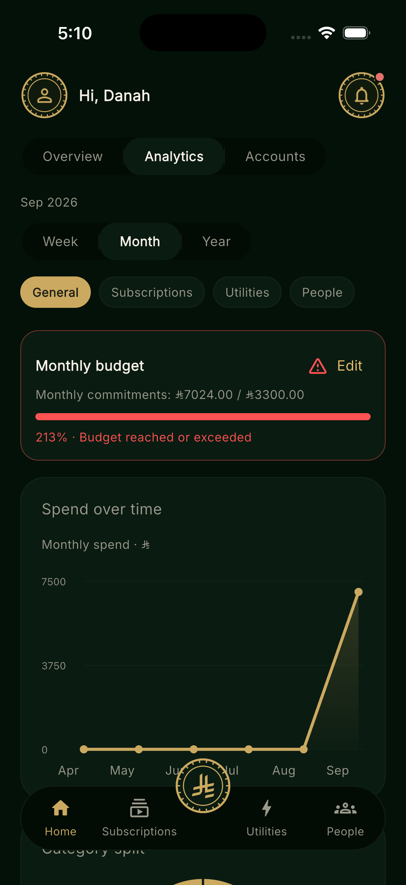 | 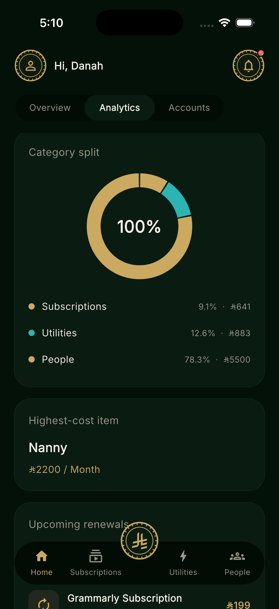 | 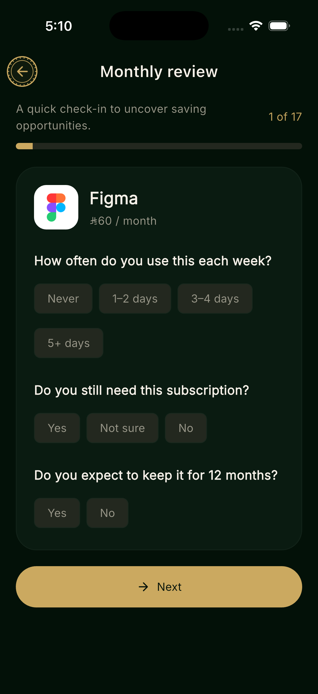 | 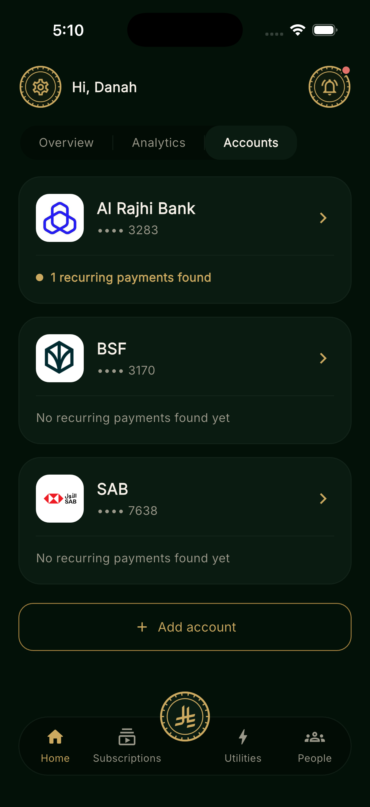 | 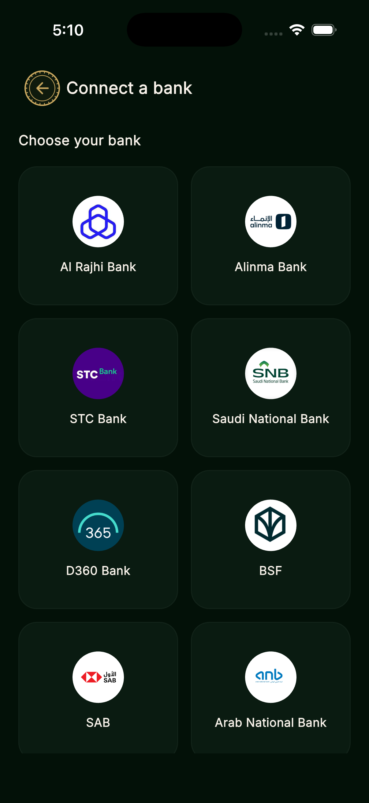 | 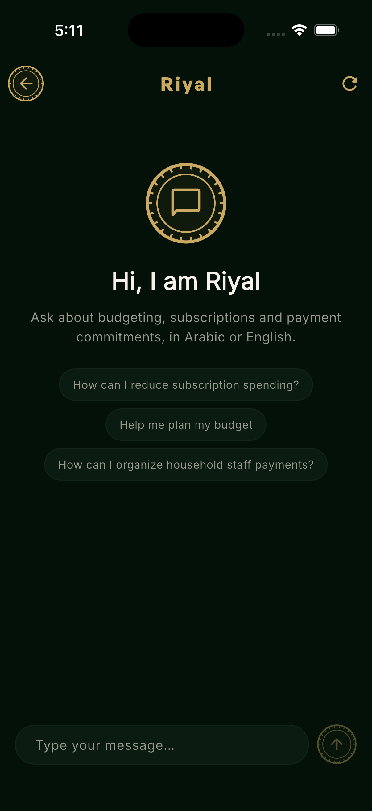 |

---

## 🧭 App Structure

The main navigation consists of:

**Home · Subscriptions · Utilities · People**

Additional screens include:

- Analytics
- Accounts
- Notifications
- Profile & Settings
- Monthly Review
- About Us
- Contact Us
- Riyal Bot

### User Flow

```text
Splash
  ↓
Onboarding
  ↓
Login / Sign Up
  ↓
Optional Bank Connection
  ↓
Budget Setup
  ↓
Home
  ↓
Track • Analyze • Manage
```

## 🎨 Design & Branding

Riyal follows a dark fintech-inspired visual identity built around the Saudi Riyal.

**Color palette**

| Purpose | Color |
| --- | --- |
| Background | `#031108` |
| Primary accent | `#CBA960` |
| Utilities | `#2CB3B3` |
| People | `#BD7D60` |

**Status colors**

- 🟢 Active
- 🟡 Trial
- 🔴 Cancelled
- ⚪ Paused

The interface uses a custom GeneralSans font family and a recurring gold coin motif throughout the application.

## 🛠️ Tech Stack

**Frontend**
- Flutter, Dart
- Responsive UI
- Arabic / English localization, RTL support

**Backend**
- Supabase, PostgreSQL
- Supabase Authentication
- SQL migrations

**AI**
- Google Gemini API
- Riyal Bot — scoped AI financial assistance

**APIs & Networking**
- HTTP APIs
- JSON-based data handling
- Mock financial transaction data

**Local Storage**
- shared_preferences

**Additional Packages**
- flutter_svg, google_fonts, flutter_dotenv, http, flutter_launcher_icons

**Development Tools**
- Git, GitHub, VS Code, Xcode, Android Studio

## 🗄️ Data & Backend Architecture

Riyal uses Supabase for its backend infrastructure.

The project contains 13 SQL migrations that evolved from an initial bank-integration experiment into the current simulated banking system.

The current architecture uses mock banking data consisting of:

- Mock banks
- User bank accounts
- Mock transactions

Recurring-payment detection and utility anomaly detection operate against the simulated transaction feed.

Subscriptions, utilities, and people payments are maintained as separate but structurally similar domains within the application.

## 🧠 Smart Detection

One of Riyal's core features is its recurring-payment detection system.

The system analyzes transaction patterns and looks for repeated charges.

```text
Transaction Feed
  ↓
Pattern Analysis
  ↓
Repeated Merchant Detected
  ↓
Recurring Payment Identified
  ↓
Category Classification
  ↓
Added to Riyal
```

A merchant appearing four or more times can be automatically recognized as a recurring payment without requiring manual confirmation.

## 🔐 Authentication & Data Handling

Riyal uses Supabase Authentication for email/password authentication.

For this student project, most application data is scoped using a generated device ID rather than relying entirely on a real authenticated banking identity.

This is a deliberate simplification for the project's demonstration environment.

The application does not connect to real bank accounts or process real banking transactions.

## 🧪 Testing

The project includes 20 test files covering major application functionality, including:

- Authentication screen responsiveness
- No-overflow UI testing
- Budget calculations
- Free-trial logic
- Notification state
- Recurring-payment detection
- Bank transaction matching
- Transaction parsing
- Monthly review logic
- Onboarding
- Profile validation
- Arabic / English locale switching
- Riyal Bot navigation
- Gemini API integration

Testing helps ensure that both the financial logic and responsive UI behave consistently across the application.


## 📂 Project Structure

```text
Riyal/
├── android/, ios/, macos/, windows/, linux/, web/   Platform projects
├── lib/
│   ├── data/       Data models, stores, budgets, detection logic, Supabase access
│   ├── l10n/       Arabic and English localization
│   ├── screens/    Application screens and user flows
│   ├── services/   Gemini API integration and Riyal Bot configuration
│   ├── theme/      Colors, typography, and application theme
│   ├── widgets/    Shared responsive UI components
│   ├── assets/     Bank/merchant logo images bundled with the app
│   └── main.dart   App entry point
├── assets/         App icon, category icons, fonts
├── supabase/
│   └── migrations/ Database schema, policies, and seeded demo data
├── test/           Widget and unit tests
├── docs/
│   └── screenshots/ Drop-in app screenshots referenced by this README
├── .env.example    Template for Supabase/Gemini environment variables
├── pubspec.yaml    Flutter project manifest and dependencies
└── README.md
```

## Developers

Danah Altamimi - دانه التميمي

Fulwah Alyahya - فلوة اليحيى

---

Made with 💚 for the Saudi consumer

